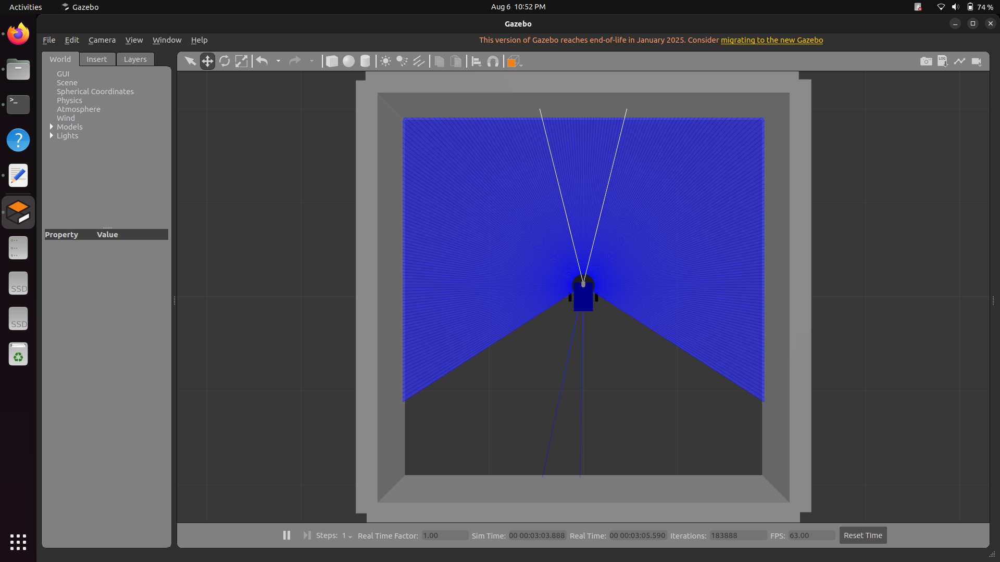
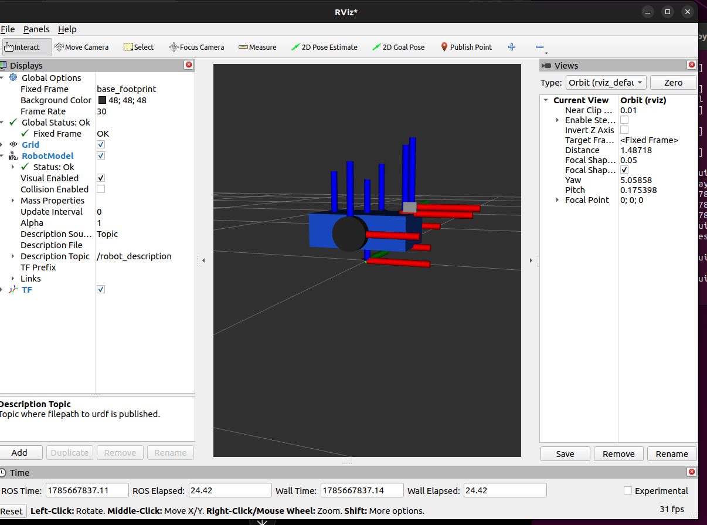
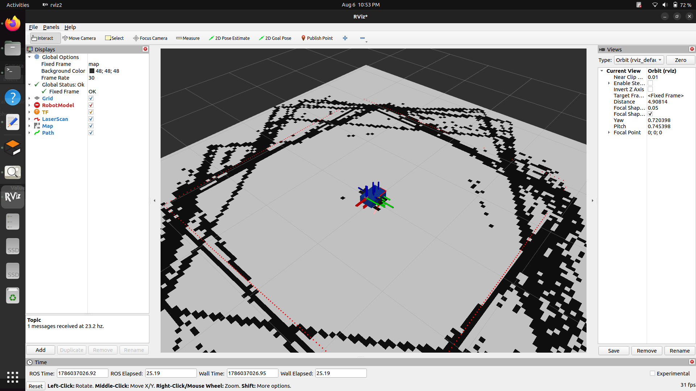
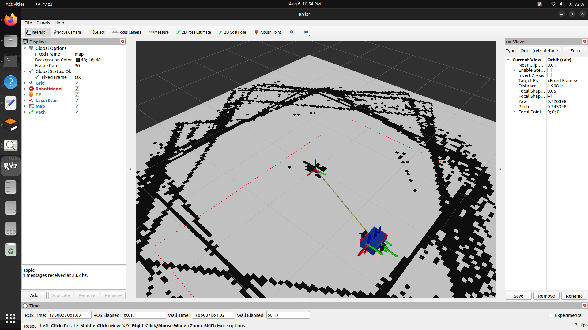
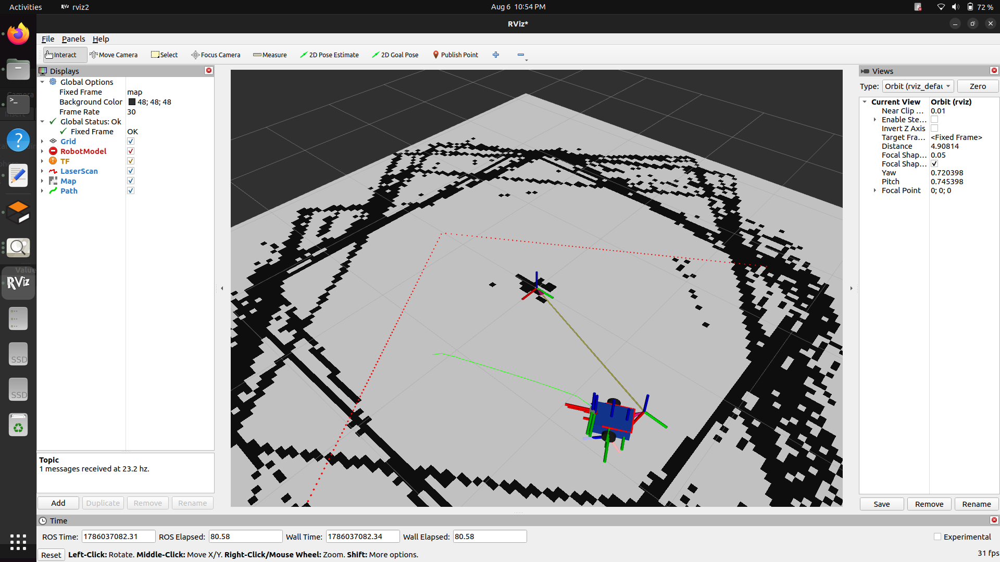
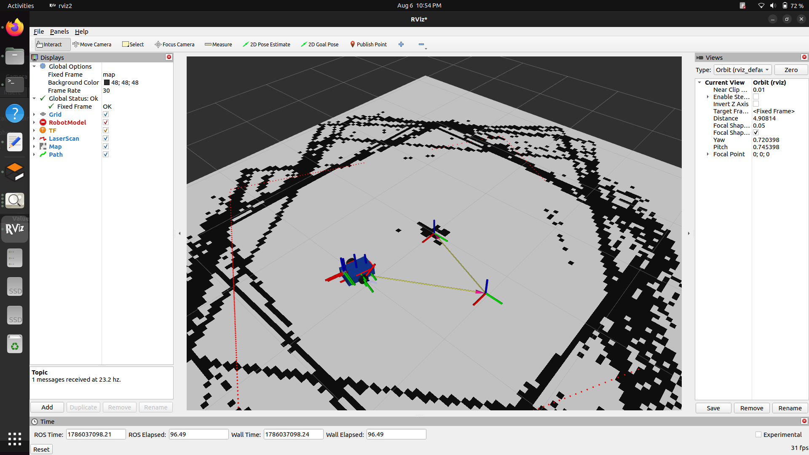

# ROS2 Differential Drive Robot


A complete **Differential Drive Mobile Robot** simulation developed using **ROS2 Humble**, **Gazebo**, **SLAM Toolbox**, and **Navigation2 (Nav2)**. The robot can generate maps using SLAM and autonomously navigate to user-defined goals using a saved map.

---

# 📌 Project Overview

This project demonstrates the complete workflow of developing a mobile robot in ROS2, starting from robot modeling to autonomous navigation.

The project includes:

- Differential Drive Robot
- Gazebo Simulation
- Modular URDF/Xacro Robot Description
- LiDAR Sensor
- RGB Camera
- IMU Sensor
- ros2_control Integration
- SLAM Toolbox Mapping
- Navigation2 (Nav2)
- AMCL Localization
- RViz Visualization

---

# ✨ Features

- Differential Drive Mobile Robot
- Modular Robot Design using Xacro
- Gazebo Simulation
- ros2_control Integration
- LiDAR Sensor
- Camera Sensor
- IMU Sensor
- SLAM Toolbox Mapping
- Occupancy Grid Map Generation
- AMCL Localization
- Autonomous Navigation
- RViz Visualization

---

# 🛠 Technologies Used

- ROS2 Humble
- Ubuntu 22.04
- Gazebo 11
- RViz2
- Navigation2 (Nav2)
- SLAM Toolbox
- URDF
- Xacro
- ros2_control
- C++

---

# 📂 Project Structure

```text
diff_drive_robot
│
├── config/
│   ├── controllers.yaml
│   ├── nav2_params.yaml
│   └── slam.yaml
│
├── launch/
│   ├── display.launch.py
│   ├── gazebo.launch.py
│   ├── navigation.launch.py
│   ├── nav2.launch.py
│   └── slam.launch.py
│
├── maps/
│   ├── my_map.pgm
│   └── my_map.yaml
│
├── rviz/
│   ├── diff_drive_robot.rviz
│   └── navigation.rviz
│
├── urdf/
│   ├── robot.xacro
│   ├── base.xacro
│   ├── wheels.xacro
│   ├── caster.xacro
│   ├── laser.xacro
│   ├── camera.xacro
│   ├── imu.xacro
│   ├── ros2_control.xacro
│   ├── gazebo.xacro
│   ├── materials.xacro
│   └── inertia_macros.xacro
│
├── worlds/
│   └── my_world.world
│
├── images/
├── package.xml
├── CMakeLists.txt
├── LICENSE
└── README.md
```

---

# 🤖 Robot Description

The robot model is created using modular Xacro files.

Robot Components:

- Base Footprint
- Base Link
- Left Wheel
- Right Wheel
- Caster Wheel
- LiDAR Sensor
- RGB Camera
- IMU Sensor

---

# 📡 Sensors

## LiDAR

- 360° Laser Scanner
- Publishes LaserScan data on `/scan`

## Camera

- RGB Camera
- Publishes camera image topics

## IMU

- Orientation
- Angular Velocity
- Linear Acceleration

---

# 🗺 SLAM Mapping

The environment is mapped using **SLAM Toolbox**.

Generated map files:

- `maps/my_map.yaml`
- `maps/my_map.pgm`

---

# 🧭 Autonomous Navigation

Navigation is implemented using **Navigation2 (Nav2)**.

Navigation Features:

- AMCL Localization
- Global Path Planning
- Local Path Planning
- Costmaps
- Obstacle Avoidance
- Goal Navigation using RViz

---

# 💻 System Requirements

- Ubuntu 22.04
- ROS2 Humble
- Gazebo 11
- Navigation2 (Nav2)
- SLAM Toolbox
- RViz2

---

# 🚀 Build

```bash
cd ~/ros2_projects_ws

colcon build --symlink-install

source install/setup.bash
```

---

# ▶️ Launch Gazebo

```bash
ros2 launch diff_drive_robot gazebo.launch.py
```

---

# ▶️ Launch SLAM

```bash
ros2 launch diff_drive_robot slam.launch.py
```

---

# ▶️ Launch Navigation

```bash
ros2 launch diff_drive_robot navigation.launch.py
```

---

# ▶️ Launch RViz

```bash
rviz2
```

Load the RViz configuration:

```text
rviz/navigation.rviz
```

---

# 📸 Project Screenshots

## Gazebo Simulation



---

## Robot Visualization in RViz



---

## SLAM Mapping



---

## Saved Occupancy Grid Map



---

## Autonomous Navigation using Nav2



---

## Robot Successfully Reached the Goal



---

# 🌳 TF Tree

The TF tree of the robot was generated using `tf2_tools`.

The complete TF tree is available here:

**images/tf_tree.pdf**

---

# ✅ Results

The robot successfully performs:

- Robot Simulation in Gazebo
- Differential Drive Motion
- LiDAR Scanning
- Camera Visualization
- IMU Data Publishing
- SLAM Mapping
- Occupancy Grid Map Generation
- AMCL Localization
- Autonomous Navigation
- Goal-based Path Planning
- Goal Execution using Nav2

---
## 🎥 Project Demo

https://github.com/user-attachments/assets/your-video-id

---
# 🎥 Demo

A demonstration video showcasing SLAM mapping and autonomous navigation will be added in a future update.

---

# 🚀 Future Improvements

- Dynamic Obstacle Avoidance
- Waypoint Navigation
- Camera-based Object Detection
- Autonomous Exploration
- Multi-Robot Simulation
- Real Robot Deployment
- Path Optimization

---

# 🙏 Acknowledgements

This project was developed using:

- ROS2 Humble
- Gazebo
- Navigation2 (Nav2)
- SLAM Toolbox
- RViz2
- ros2_control

---

# 👩‍💻 Author

**Prachi Kale**

B.Tech – Robotics & Automation Engineering

K. K. Wagh Institute of Engineering Education and Research

GitHub: https://github.com/prachikale05

---

# 📜 License

This project is licensed under the **MIT License**.
